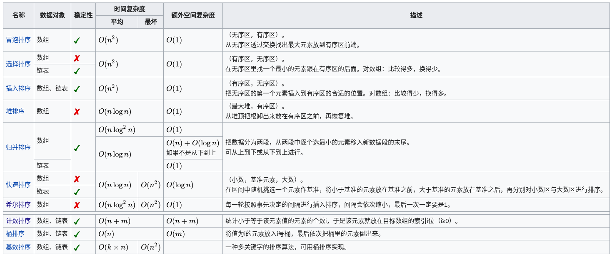

在[计算机科学](https://zh.wikipedia.org/wiki/%E8%A8%88%E7%AE%97%E6%A9%9F%E7%A7%91%E5%AD%B8 "计算机科学")与[数学](https://zh.wikipedia.org/wiki/%E6%95%B8%E5%AD%B8 "数学")中，一个**排序算法**（英语：Sorting algorithm）是一种能将一串资料依照特定排序方式进行排列的一种[算法](https://zh.wikipedia.org/wiki/%E7%AE%97%E6%B3%95 "算法")。最常用到的排序方式是数值顺序以及[字典顺序](https://zh.wikipedia.org/wiki/%E5%AD%97%E5%85%B8%E9%A0%86%E5%BA%8F "字典顺序")。有效的排序算法在一些算法（例如[搜索算法](https://zh.wikipedia.org/wiki/%E6%90%9C%E5%B0%8B%E7%AE%97%E6%B3%95 "搜索算法")与[合并算法](https://zh.wikipedia.org/w/index.php?title=%E5%90%88%E4%BD%B5%E7%AE%97%E6%B3%95&action=edit&redlink=1)（英语：[Merge algorithm](https://en.wikipedia.org/wiki/Merge_algorithm "en:Merge algorithm")））中是重要的，如此这些算法才能得到正确解答。排序算法也用在处理文字资料以及产生人类可读的输出结果。基本上，排序算法的输出必须遵守下列两个原则：

1.  输出结果为递增序列（递增是针对所需的排序顺序而言）
2.  输出结果是原输入的一种[排列](https://zh.wikipedia.org/wiki/%E6%8E%92%E5%88%97 "排列")、或是重组

虽然排序算法是一个简单的问题，但是从计算机科学发展以来，在此问题上已经有大量的研究。举例而言，[冒泡排序](https://zh.wikipedia.org/wiki/%E6%B3%A1%E6%B2%AB%E6%8E%92%E5%BA%8F "冒泡排序")在1956年就已经被研究。虽然大部分人认为这是一个已经被解决的问题，有用的新算法仍在不断的被发明。（例子：[图书馆排序](https://zh.wikipedia.org/wiki/%E5%9B%BE%E4%B9%A6%E9%A6%86%E6%8E%92%E5%BA%8F "图书馆排序")在2004年被发表）

## 目录

*   [1 分类](#分類)
    *   [1.1 稳定性](#穩定性)
*   [2 排序算法列表](#排序算法列-{}-表)
    *   [2.1 稳定的排序](#穩定的排序)
    *   [2.2 不稳定的排序](#不穩定的排序)
    *   [2.3 不实用的排序](#不實用的排序)
*   [3 简要比较](#简要比较)
*   [4 参考文献](#参考文献)
*   [5 外部链接](#外部链接)

## 分类

在[计算机科学](https://zh.wikipedia.org/wiki/%E8%AE%A1%E7%AE%97%E6%9C%BA%E7%A7%91%E5%AD%A6 "计算机科学")所使用的排序算法通常被分类为：

*   计算的[时间复杂度](https://zh.wikipedia.org/wiki/%E8%A8%88%E7%AE%97%E8%A4%87%E9%9B%9C%E6%80%A7%E7%90%86%E8%AB%96 "计算复杂性理论")（最差、平均、和最好性能），依据列表（list）的大小( n ）。
*   内存使用量（以及其他电脑资源的使用）
*   稳定性：**稳定排序算法**会让原本有相等键值的纪录维持相对次序。也就是如果一个排序算法是**稳定**的，当有两个相等键值的纪录 R 之前。
*   依据排序的方法：插入、交换、选择、合并等等。

### 稳定性

当相等的元素是无法分辨的，比如像是整数，稳定性并不是一个问题。然而，假设以下的数对将要以他们的第一个数字来排序。

    (4,1)(3,1)(3,7)(5,6)

在这个状况下，有可能产生两种不同的结果，一个是让相等键值的纪录维持相对的次序，而另外一个则没有：

```java
(3,1)(3,7)(4,1)(5,6)（維持次序）
(3,7)(3,1)(4,1)(5,6)（次序被改變）
```

不稳定排序算法可能会在相等的键值中改变纪录的相对次序，但是稳定排序算法从来不会如此。不稳定排序算法可以被特别地实现为稳定。作这件事情的一个方式是人工扩展键值的比较，如此在其他方面相同键值的两个对象间之比较，（比如上面的比较中加入第二个标准：第二个键值的大小）就会被决定使用在原先资料次序中的条目，当作一个同分决赛。然而，要记住这种次序通常牵涉到额外的空间负担。

## 排序算法列表

在这个表格中， n 是不同键值的数量。

### 稳定的排序

*   [冒泡排序](https://zh.wikipedia.org/wiki/%E5%86%92%E6%B3%A1%E6%8E%92%E5%BA%8F "冒泡排序")（bubble sort）— O ( n 2 ) 
*   [插入排序](https://zh.wikipedia.org/wiki/%E6%8F%92%E5%85%A5%E6%8E%92%E5%BA%8F "插入排序")（insertion sort）— O ( n 2 ) 
*   [鸡尾酒排序](https://zh.wikipedia.org/wiki/%E9%B8%A1%E5%B0%BE%E9%85%92%E6%8E%92%E5%BA%8F "鸡尾酒排序")（cocktail sort）— O ( n 2 ) 
*   [桶排序](https://zh.wikipedia.org/wiki/%E6%A1%B6%E6%8E%92%E5%BA%8F "桶排序")（bucket sort）— O ( n ) 额外空间
*   [计数排序](https://zh.wikipedia.org/wiki/%E8%AE%A1%E6%95%B0%E6%8E%92%E5%BA%8F "计数排序")（counting sort）— O ( n + k ) 额外空间
*   [归并排序](https://zh.wikipedia.org/wiki/%E5%BD%92%E5%B9%B6%E6%8E%92%E5%BA%8F "归并排序")（merge sort）— O ( n log ⁡ n ) 额外空间
*   原地[归并排序](https://zh.wikipedia.org/wiki/%E5%BD%92%E5%B9%B6%E6%8E%92%E5%BA%8F "归并排序")— O ( n log 2 ⁡ n ) 如果使用最佳的现在版本
*   [二叉排序树](https://zh.wikipedia.org/wiki/%E4%BA%8C%E5%8F%89%E6%8E%92%E5%BA%8F%E6%A0%91 "二叉排序树")排序（binary tree sort）— O ( n log ⁡ n ) 额外空间
*   [鸽巢排序](https://zh.wikipedia.org/wiki/%E9%B8%BD%E5%B7%A2%E6%8E%92%E5%BA%8F "鸽巢排序")（pigeonhole sort）— O ( n + k ) 额外空间
*   [基数排序](https://zh.wikipedia.org/wiki/%E5%9F%BA%E6%95%B0%E6%8E%92%E5%BA%8F "基数排序")（radix sort）— O ( n k ) 额外空间
*   [侏儒排序](https://zh.wikipedia.org/wiki/%E4%BE%8F%E5%84%92%E6%8E%92%E5%BA%8F "侏儒排序")（gnome sort）— O ( n 2 ) 
*   [图书馆排序](https://zh.wikipedia.org/wiki/%E5%9B%BE%E4%B9%A6%E9%A6%86%E6%8E%92%E5%BA%8F "图书馆排序")（library sort）— O ( n log ⁡ n ) 额外空间
*   [块排序](https://zh.wikipedia.org/w/index.php?title=%E5%A1%8A%E6%8E%92%E5%BA%8F&action=edit&redlink=1)（英语：[Block sort](https://en.wikipedia.org/wiki/Block_sort "en:Block sort")）（block sort）— O ( n log ⁡ n ) 

### 不稳定的排序

*   [选择排序](https://zh.wikipedia.org/wiki/%E9%81%B8%E6%93%87%E6%8E%92%E5%BA%8F "选择排序")（selection sort）— O ( n 2 ) 
*   [希尔排序](https://zh.wikipedia.org/wiki/%E5%B8%8C%E5%B0%94%E6%8E%92%E5%BA%8F "希尔排序")（shell sort）— O ( n log 2 ⁡ n ) 如果使用最佳的现在版本
*   [克洛弗排序](https://zh.wikipedia.org/w/index.php?title=%E5%85%8B%E6%B4%9B%E5%BC%97%E6%8E%92%E5%BA%8F&action=edit&redlink=1 "克洛弗排序（页面不存在）")（Clover sort）— O ( n ) 最坏情况[\[来源请求\]](https://zh.wikipedia.org/wiki/Wikipedia:%E5%88%97%E6%98%8E%E6%9D%A5%E6%BA%90 "Wikipedia:列明来源")
*   [梳排序](https://zh.wikipedia.org/wiki/%E6%A2%B3%E6%8E%92%E5%BA%8F "梳排序")— O ( n log ⁡ n ) 
*   [堆排序](https://zh.wikipedia.org/wiki/%E5%A0%86%E6%8E%92%E5%BA%8F "堆排序")（heap sort）— O ( n log ⁡ n ) 
*   [平滑排序](https://zh.wikipedia.org/w/index.php?title=%E5%B9%B3%E6%BB%91%E6%8E%92%E5%BA%8F&action=edit&redlink=1)（英语：[Smoothsort](https://en.wikipedia.org/wiki/Smoothsort "en:Smoothsort")）（smooth sort）— O ( n log ⁡ n ) 
*   [快速排序](https://zh.wikipedia.org/wiki/%E5%BF%AB%E9%80%9F%E6%8E%92%E5%BA%8F "快速排序")（quick sort）— O ( n log ⁡ n ) 最坏情况；对于大的、随机数列表一般相信是最快的已知排序
*   [内省排序](https://zh.wikipedia.org/wiki/%E5%86%85%E7%9C%81%E6%8E%92%E5%BA%8F "内省排序")（introsort）— O ( n log ⁡ n ) 
*   [耐心排序](https://zh.wikipedia.org/wiki/%E8%80%90%E5%BF%83%E6%8E%92%E5%BA%8F "耐心排序")（patience sort）— O ( n log ⁡ n + k ) 空间，也需要找到[最长的递增子序列](https://zh.wikipedia.org/w/index.php?title=%E6%9C%80%E9%95%B7%E7%9A%84%E9%81%9E%E5%A2%9E%E5%AD%90%E5%BA%8F%E5%88%97&action=edit&redlink=1 "最长的递增子序列（页面不存在）")（longest increasing subsequence）

### 不实用的排序

*   [Bogo排序](https://zh.wikipedia.org/wiki/Bogo%E6%8E%92%E5%BA%8F "Bogo排序")— O ( n × n ! ) ，最坏的情况下期望时间为无穷。
*   [Stupid排序](https://zh.wikipedia.org/w/index.php?title=Stupid%E6%8E%92%E5%BA%8F&action=edit&redlink=1 "Stupid排序（页面不存在）")— O ( n 3 ) 额外存储器
*   [珠排序](https://zh.wikipedia.org/wiki/%E7%8F%A0%E6%8E%92%E5%BA%8F "珠排序")（bead sort）— O ( n ) ,但需要特别的硬件
*   [煎饼排序](https://zh.wikipedia.org/wiki/%E7%85%8E%E9%A4%85%E6%8E%92%E5%BA%8F "煎饼排序")— O ( n ) ,但需要特别的硬件
*   [臭皮匠排序](https://zh.wikipedia.org/wiki/%E8%87%AD%E7%9A%AE%E5%8C%A0%E6%8E%92%E5%BA%8F "臭皮匠排序")（stooge sort）算法简单，但需要约 n 2.7 的时间

## 简要比较



*   均按从小到大排列
*   k代表数值中的"数位"个数
*   n代表数据规模
*   m代表数据的最大值减最小值

## 参考文献

## 外部链接

*   [不同排序算法间的比较（英语）](https://commons.wikimedia.org/wiki/File:SortingAlgoComp.png)
*   [一些排序算法的C及Pascal实现](https://web.archive.org/web/20101024150215/http://www.nocow.cn/index.php/%E6%8E%92%E5%BA%8F%E7%AE%97%E6%B3%95)
*   [可视化排序](http://panthema.net/2013/sound-of-sorting/)